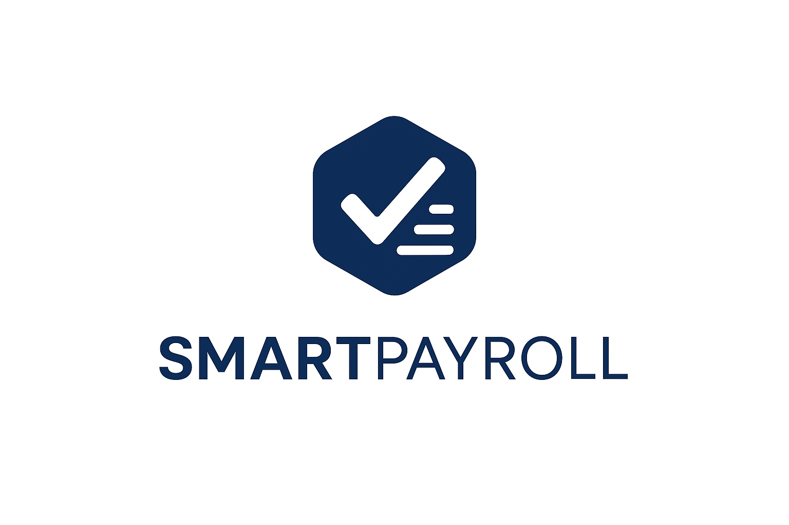
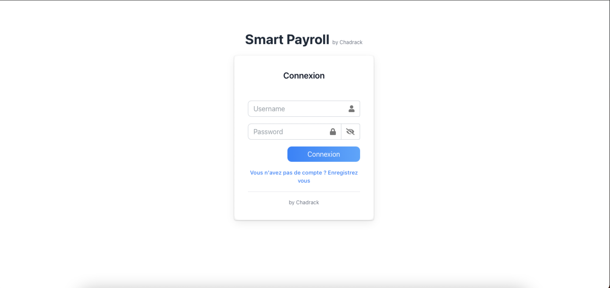
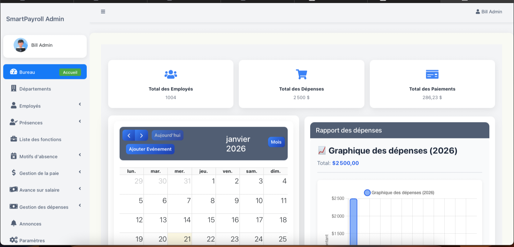
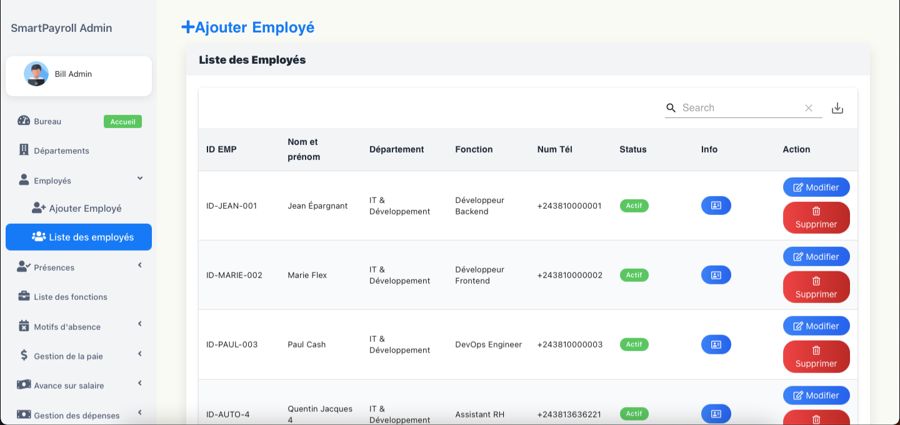
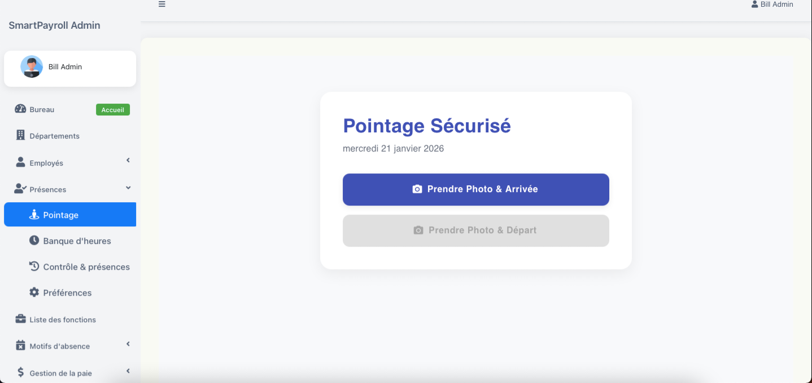
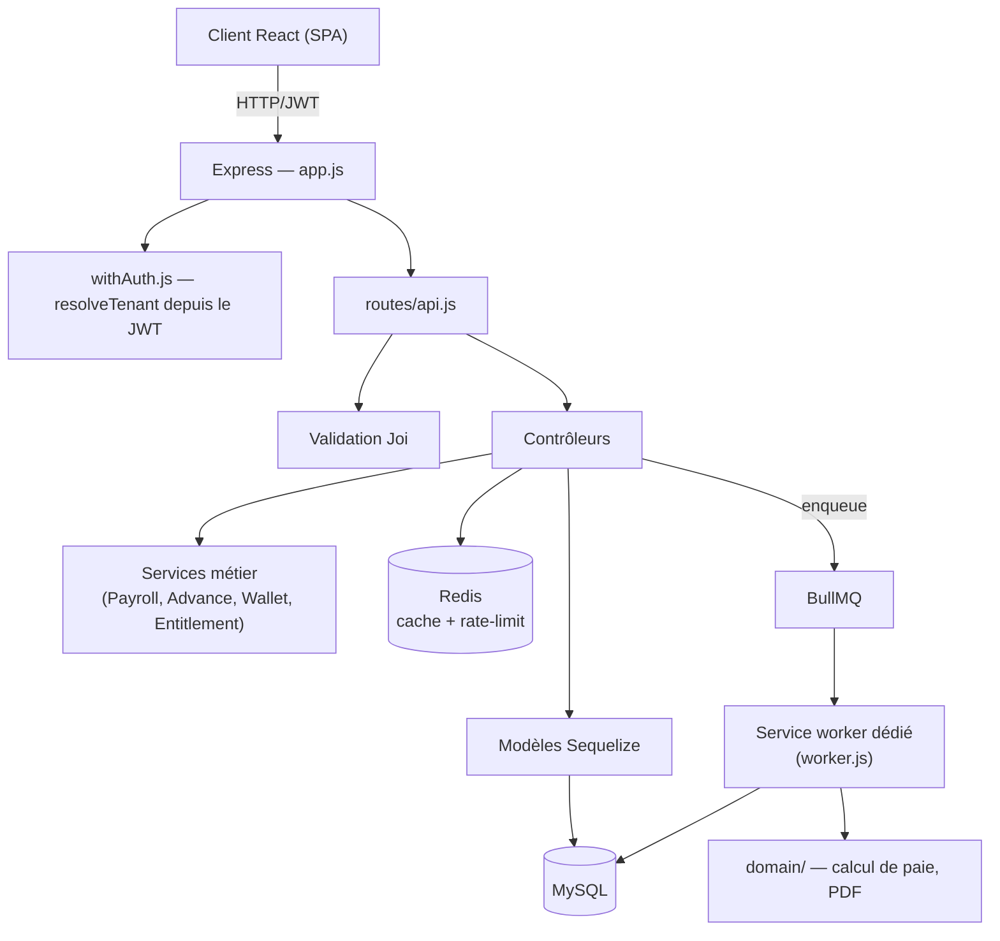

<p align="center">
  
</p>

<h1 align="center">SmartPayroll — Plateforme SaaS de gestion RH & paie (RDC)</h1>

<p align="center">
  Système de gestion de la paie, des présences et des ressources humaines, conçu pour le contexte réglementaire et opérationnel de la République Démocratique du Congo, et transformé d'un logiciel on-premise mono-poste en une plateforme SaaS multi-tenant.
</p>

<p align="center">
  <a href="https://hrmanagement-production-5a35.up.railway.app/login"><strong>🌐 Application en production</strong></a>
  &nbsp;·&nbsp;
  <a href="./docs/CASE-STUDY.md"><strong>📑 Cas d'étude</strong></a>
  &nbsp;·&nbsp;
  <a href="./docs/ARCHITECTURE-SAAS.md"><strong>🏗️ Architecture SaaS</strong></a>
</p>

<p align="center">
  
  
  
  
  
  
  
  
</p>

---

## ⚡ En bref

- **Déployé en production, en phase de commercialisation** : paie, présences et RH pensés pour les entreprises en RDC, hébergé sur Railway.
- **Migration on-premise → SaaS multi-tenant** : isolation par organisation résolue depuis le JWT, facturation par wallet prépayé rechargé par mobile money.
- **Audit de production-readiness** : 47 dettes techniques identifiées (dont 6 critiques), toutes closes au terme d'un plan de remédiation en 5 phases.
- **Tests contre une vraie base** : 147 fichiers de test, CI GitHub Actions en 8 étapes (MySQL/Redis réels, `npm audit`, gitleaks, build Docker).

---

## 📖 À propos

**SmartPayroll** automatise deux fonctions à haute friction pour une entreprise en RDC : **le suivi des présences** (avec preuve anti-fraude) et **le calcul de la paie** (avec la fiscalité locale — IPR à barème progressif, CNSS, ONEM, INPP). Le produit a démarré comme un logiciel **on-premise** distribué en binaire (licence chiffrée, MySQL portable) et a été **entièrement repensé en architecture SaaS multi-tenant** hébergée, avec facturation par mobile money — un choix dicté par la réalité du marché local (le prélèvement automatique récurrent n'y est pas fiable ; le mobile money fonctionne en paiement poussé, confirmé par le client à chaque transaction).

Ce dépôt présente le projet sans en exposer le code source : il illustre la démarche d'ingénierie (architecture, sécurité, remédiation méthodique, CI/CD) plutôt que de servir de produit déployable tel quel.

---

## 🖼️ Aperçu

| Connexion | Tableau de bord administrateur |
|---|---|
|  |  |

| Liste des employés | Pointage sécurisé (photo + GPS) |
|---|---|
|  |  |

> L'application est accessible en production : **[hrmanagement-production-5a35.up.railway.app](https://hrmanagement-production-5a35.up.railway.app/login)**

---

## 🎯 Problème résolu

| Avant | Avec SmartPayroll |
|---|---|
| Suivi des présences sur feuille de calcul, falsifiable, sans preuve | Pointage GPS + photo obligatoire + détection de rejeu (hash perceptif), avec file d'attente **offline** pour la connectivité intermittente du terrain |
| Calcul de paie manuel, sujet à erreur sur les barèmes fiscaux RDC | Moteur de paie automatisé : IPR progressif, heures supplémentaires/déficits avec système de banque d'heures, avances sur salaire plafonnées, bulletins PDF générés à la volée |
| Un déploiement = un client, licence fichier chiffrée, mise à jour manuelle | SaaS multi-tenant hébergé, isolation stricte par organisation, mise à jour continue |
| Facturation incompatible avec les moyens de paiement locaux | Wallet prépayé rechargé par mobile money (paiement poussé), pas de prélèvement automatique |
| Aucune garantie que le code tenait ses promesses en conditions réelles | Suite de tests contre une **vraie base MySQL** (pas seulement des mocks) en CI, gitleaks, npm audit, build Docker — voir [`docs/CASE-STUDY.md`](./docs/CASE-STUDY.md) |

---

## ✨ Fonctionnalités

**Présences & anti-fraude**
- Pointage géolocalisé (comparaison position employé / site autorisé)
- Photo obligatoire au check-in/check-out, hash perceptif anti-rejeu
- File d'attente de pointage **offline** (IndexedDB, idempotence par UUID client, résolution des écarts d'horloge par paliers de tolérance)
- Banque d'heures : heures supplémentaires payées, banquées ou compensant un déficit

**Paie & conformité RDC**
- Moteur de calcul avec barème IPR progressif paramétrable, CNSS, ONEM, INPP
- Avances sur salaire avec plafond (workflow de demande → validation → historique de statuts)
- Génération de bulletins PDF, jobs de calcul en arrière-plan (BullMQ) pour ne jamais bloquer l'API
- Report de dette de paie, workflow de régularisation

**RH & organisation**
- Départements, postes, documents employés, annonces internes
- Gestion des absences par motif, congés

**SaaS, facturation & plateforme**
- Multi-tenant strict : isolation par `organizationId` à chaque requête, vérifiée par une matrice de tests d'autorisation (tenant A / B / null) contre une vraie base
- Wallet prépayé + abonnements avec machine à états (`TRIAL → ACTIVE → PAST_DUE → GRACE_PERIOD → SUSPENDED/CANCELED`)
- Intégration mobile money via une interface `PaymentProvider` découplée du fournisseur (webhook signé + idempotent, job de réconciliation de secours)
- Console **Platform Admin** entièrement séparée du tenant (JWT et secret distincts, MFA obligatoire), avec journal d'audit sur chaque action

---

## 🏗️ Architecture



- **Monolithe modulaire** assumé (pas de microservices) : une seule base de code, un seul pipeline de déploiement, cohérent avec une équipe restreinte — la séparation se fait par **modules et responsabilités**, pas par des frontières réseau.
- **Deux services de déploiement distincts issus de la même image** : `web` (API Express + build React statique) et `worker` (consommateurs BullMQ uniquement, aucun port HTTP exposé) — scalables indépendamment, sans double traitement des jobs (déduplication BullMQ par `jobId`).
- **Pattern MVC + Services + Repository partiel** : les contrôleurs orchestrent, les services encapsulent la logique métier transverse (paie, wallet, avances), un repository partiel isole l'accès aux données pour les entités les plus sensibles.
- **Isolation multi-tenant** : `organizationId` résolu depuis le JWT (jamais depuis un paramètre client), propagé et vérifié dans chaque requête — prouvé par une suite de tests contre une vraie base plutôt que par une simple relecture de code.

---

## 🧠 Choix techniques marquants

Quelques décisions qui, à mon sens, valent la peine d'être détaillées pour comprendre le niveau de rigueur du projet :

- **Facturation par wallet prépayé, pas par prélèvement récurrent.** Le mobile money en RDC est un paiement *poussé* : le client confirme chaque transaction. Un modèle de facturation calqué sur les habitudes occidentales (carte + débit automatique) n'aurait tout simplement pas fonctionné sur ce marché.
- **`attemptSubscriptionDebitOrReactivation` comme point de verrouillage unique.** Toute opération qui doit verrouiller à la fois un abonnement et un wallet passe par une seule fonction, dans un ordre de verrouillage garanti *structurellement* (jamais laissé à la discipline de chaque site d'appel) — élimine une classe entière de deadlocks potentiels.
- **Archivage applicatif plutôt que partitionnement MySQL natif.** Partitionner `attendance_record`/`audit_log` aurait exigé de changer leur clé primaire (la colonne de partition doit figurer dans toute clé unique) — un changement de schéma jugé trop risqué sans pouvoir le valider contre un jeu de données de production. Un archivage vers des tables miroir (`CREATE TABLE ... LIKE`) offre un gain équivalent avec un risque largement inférieur.
- **Migrations idempotentes par construction.** Chaque migration vérifie l'état du schéma avant de le modifier (`describeTable`/`showIndex`/`tableExists`) — la chaîne complète peut être rejouée sans erreur sur une base vierge *ou* déjà partiellement migrée, un prérequis pour un déploiement continu fiable.
- **Deux JWT, deux secrets, deux audiences.** Le token d'un administrateur d'organisation (`aud: "tenant"`) et celui d'un opérateur de la plateforme (`aud: "platform"`) ne sont jamais interchangeables — testé explicitement, pas seulement supposé.
- **Pointage offline avec résolution d'horloge à paliers.** Plutôt qu'un seuil binaire accepté/rejeté, un écart d'horloge entre le client et le serveur est traité en trois paliers (silencieux / à valider manuellement / exclu de la paie jusqu'à validation) — pour ne jamais faire perdre une journée de salaire à un employé réellement présent à cause d'un bug d'horloge.
- **Suppression directe du code mort, jamais commenté « au cas où ».** Git est l'historique ; un commentaire expliquant *pourquoi* on a supprimé pollue la lecture du fichier vivant bien plus qu'il ne rassure.

---

## 🔐 Sécurité

- Isolation tenant vérifiée par des tests d'autorisation paramétrés (A / B / null) contre une vraie base, pas seulement des mocks
- JWT à courte durée de vie + rotation des refresh tokens, révocation immédiate à la désactivation d'un compte
- Helmet (CSP/HSTS), CORS en liste blanche, rate-limiting distribué via Redis
- Téléchargements de fichiers authentifiés et scopés par organisation/rôle (jamais de stockage statique public pour des données RH)
- Webhooks de paiement : signature vérifiée **avant** tout traitement, idempotence garantie par contrainte d'unicité
- Scan de secrets (gitleaks) et audit de dépendances (`npm audit`) intégrés à chaque exécution de CI

---

## 🧪 Qualité, tests & CI/CD

- **147 fichiers de test**, unitaires *et* d'intégration contre une vraie base MySQL (pas seulement des mocks Sequelize) — la matrice d'autorisation multi-tenant, en particulier, ne pouvait être prouvée que contre un moteur SQL réel.
- **Pipeline CI en 8 étapes** (GitHub Actions) : lint + vérification de types (JSDoc/`@ts-check` progressif), tests unitaires + d'intégration, tests client React, suites contre une vraie base MySQL/Redis, audit de sécurité npm, détection de secrets (gitleaks), build de l'image Docker de production, build du frontend.
- Avant la mise en production, j'ai mené un **audit de production-readiness** du projet, qui a identifié 47 éléments de dette technique (6 critiques, 17 majeurs) — intégralement traités via un plan de remédiation en 5 phases. Le détail de cette démarche, avec les résultats chiffrés, fait l'objet d'un cas d'étude séparé : **[`docs/CASE-STUDY.md`](./docs/CASE-STUDY.md)**.

---

## 📂 Structure du projet

Le code source est privé. Voici l'organisation du dépôt principal, pour donner une idée du découpage :

```
.
├── server.js / worker.js   # Points d'entrée : API HTTP / consommateurs BullMQ
├── app.js                  # Application Express (middlewares, routage)
├── controllers/            # Logique métier par entité (CRUD Sequelize)
├── services/               # Services transverses (paie, avances, wallet, entitlements)
├── domain/                 # Calcul de paie et génération PDF
├── repository/             # Accès aux données pour les entités sensibles
├── models/                 # Modèles Sequelize + associations
├── migrations/             # Migrations idempotentes
├── workers/                # Consommateurs BullMQ (paie, billing, archivage, rétention)
├── middlewares/            # Auth, upload, feature flags
├── validators/             # Schémas Joi
├── __tests__/              # Tests unitaires + intégration (vraie base)
├── client/                 # Frontend React (SPA)
└── doc/                    # Architecture, audits, runbooks
```

---

## 📚 Documentation complémentaire

- [`docs/CASE-STUDY.md`](./docs/CASE-STUDY.md) — la démarche d'audit et de remédiation production-readiness, en détail
- [`docs/ARCHITECTURE-SAAS.md`](./docs/ARCHITECTURE-SAAS.md) — transformation SaaS multi-tenant : décisions d'architecture, modèle de facturation, sécurité plateforme

---

## ⚠️ À propos de ce dépôt vitrine

Ce dépôt présente le projet **SmartPayroll** (documentation et captures, sans le code source), pour illustrer une démarche d'ingénierie (architecture SaaS, sécurité multi-tenant, remédiation méthodique, rigueur de test/CI) sur un domaine métier réel et complexe (paie et RH en contexte RDC). Aucune donnée de production, secret ou identifiant client n'y figure.

---

## 📞 Contact

**Schadrack Ngunza**

- Email : [schadrackngunza@gmail.com](mailto:schadrackngunza@gmail.com)
- LinkedIn : [linkedin.com/in/schadrackngunza](https://www.linkedin.com/in/schadrackngunza)
- GitHub : [@Schandroid243](https://github.com/Schandroid243)
