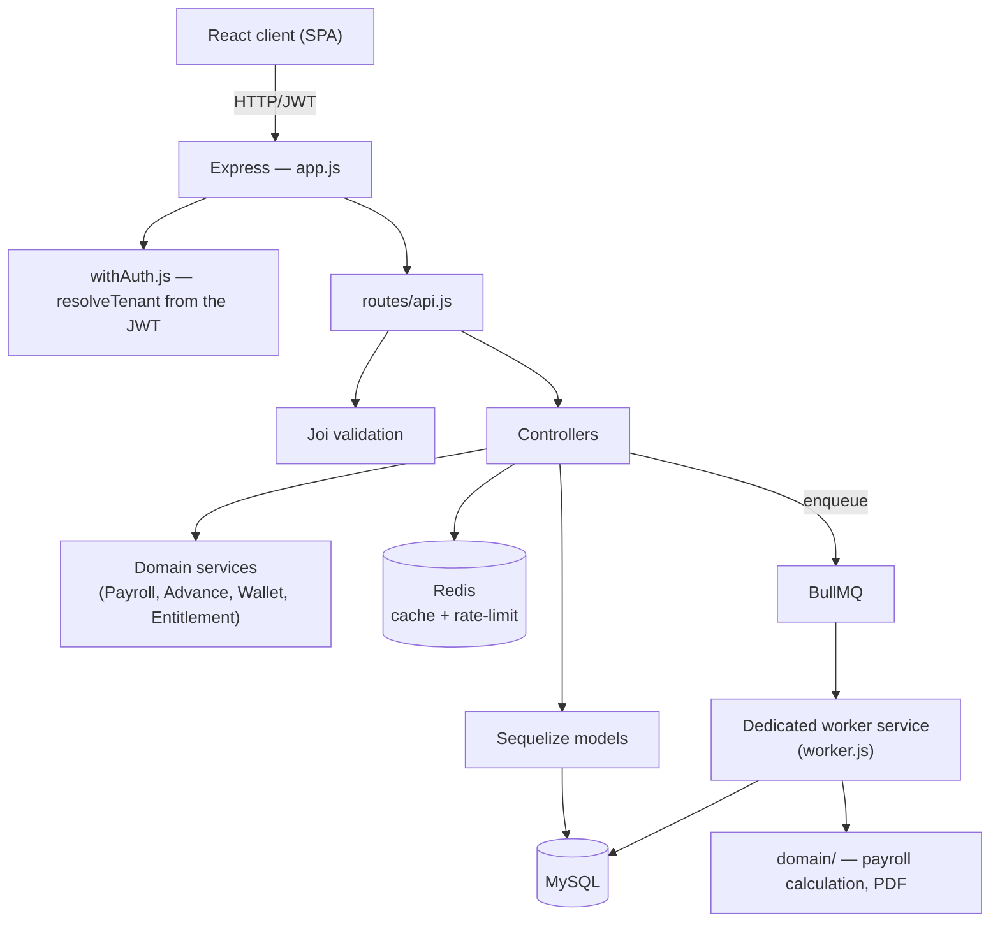

<p align="center">
  
</p>

<h1 align="center">SmartPayroll — Multi-tenant HR & Payroll SaaS (DR Congo)</h1>

<p align="center">
  Payroll, attendance and HR management built for the regulatory and operational context of the Democratic Republic of the Congo, and rebuilt from single-site on-premise software into a hosted multi-tenant SaaS platform.
</p>

<p align="center">
  <strong>English</strong> · <a href="./README.fr.md">Français</a>
</p>

<p align="center">
  <a href="https://hrmanagement-production-5a35.up.railway.app/login"><strong>🌐 Live app</strong></a>
  &nbsp;·&nbsp;
  <a href="./docs/CASE-STUDY.md"><strong>📑 Case study</strong></a>
  &nbsp;·&nbsp;
  <a href="./docs/ARCHITECTURE-SAAS.md"><strong>🏗️ SaaS architecture</strong></a>
</p>

<p align="center">
  
  
  
  
  
  
  
  
</p>

---

## ⚡ At a glance

- **Deployed in production, now in its commercial launch phase**: payroll, attendance and HR designed for businesses in the DRC, hosted on Railway.
- **On-premise → multi-tenant SaaS migration**: organization isolation resolved from the JWT, billing through a prepaid wallet topped up with mobile money.
- **Production-readiness audit**: 47 technical debt items found (6 critical), all closed through a 5-phase remediation plan.
- **Tests against a real database**: 147 test files, an 8-stage GitHub Actions pipeline (real MySQL/Redis, `npm audit`, gitleaks, Docker build).

---

## 📖 About

**SmartPayroll** automates two high-friction tasks for companies in the DRC: **attendance tracking** (with anti-fraud proof) and **payroll calculation** (with local taxation: progressive IPR income tax brackets, CNSS, ONEM, INPP). The product started as **on-premise** software shipped as a binary (encrypted license, portable MySQL) and was **fully redesigned as a hosted multi-tenant SaaS**, billed through mobile money. That last choice comes straight from the local market: recurring direct debit isn't reliable there, while mobile money works as a *push* payment the customer confirms for each transaction.

This repository presents the project without exposing its source code. It shows the engineering approach (architecture, security, methodical remediation, CI/CD) rather than a deployable product.

---

## 🖼️ Screenshots

| Login | Admin dashboard |
|---|---|
|  |  |

| Employee list | Secure clock-in (photo + GPS) |
|---|---|
|  |  |

> **Live demo:** the app runs in production at [hrmanagement-production-5a35.up.railway.app](https://hrmanagement-production-5a35.up.railway.app/login). Access requires an account: demo credentials on a sandboxed test organization are available on request (see [Contact](#-contact)).

The UI is in French, the working language of the target market.

---

## 🎯 The problem it solves

| Before | With SmartPayroll |
|---|---|
| Attendance tracked in spreadsheets, easy to falsify, no proof | GPS clock-in + mandatory photo + replay detection (perceptual hash), with an **offline** queue for intermittent field connectivity |
| Manual payroll, error-prone on DRC tax brackets | Automated payroll engine: progressive IPR, overtime/shortfall with an hour bank, capped salary advances, payslips generated as PDF on demand |
| One deployment per customer, encrypted license file, manual updates | Hosted multi-tenant SaaS, strict per-organization isolation, continuous updates |
| Billing incompatible with local payment methods | Prepaid wallet topped up via mobile money (push payment), no direct debit |
| No guarantee the code held up under real conditions | Tests run against a **real MySQL database** (not just mocks) in CI, plus gitleaks, npm audit and a Docker build. See [`docs/CASE-STUDY.md`](./docs/CASE-STUDY.md) |

---

## ✨ Features

**Attendance & anti-fraud**
- Geolocated clock-in (employee position checked against the authorized site)
- Mandatory photo at check-in/check-out, perceptual hash against replays
- **Offline** clock-in queue (IndexedDB, idempotency through a client-side UUID, tiered tolerance for clock drift)
- Hour bank: overtime is paid, banked, or used to offset a shortfall

**Payroll & DRC compliance**
- Calculation engine with configurable progressive IPR brackets, CNSS, ONEM, INPP
- Capped salary advances (request → approval → status history workflow)
- PDF payslips, background payroll jobs (BullMQ) so the API is never blocked
- Payroll debt carry-over, correction/adjustment workflow

**HR & organization**
- Departments, positions, employee documents, internal announcements
- Absence management by reason, leave

**SaaS, billing & platform**
- Strict multi-tenancy: `organizationId` isolation on every request, verified by an authorization test matrix (tenant A / B / null) against a real database
- Prepaid wallet + subscriptions driven by a state machine (`TRIAL → ACTIVE → PAST_DUE → GRACE_PERIOD → SUSPENDED/CANCELED`)
- Mobile money integration behind a provider-agnostic `PaymentProvider` interface (signed, idempotent webhooks, with a fallback reconciliation job)
- **Platform Admin** console fully separated from tenants (distinct JWT and secret, mandatory MFA), with an audit log on every action

---

## 🏗️ Architecture



- **Modular monolith**, on purpose (no microservices): one codebase, one deployment pipeline, a good fit for a small team. Separation happens through **modules and responsibilities**, not network boundaries.
- **Two deployment services built from the same image**: `web` (Express API + static React build) and `worker` (BullMQ consumers only, no HTTP port). They scale independently, and jobs are never processed twice (BullMQ deduplication by `jobId`).
- **MVC + Services + partial Repository**: controllers orchestrate, services hold cross-cutting business logic (payroll, wallet, advances), and a partial repository isolates data access for the most sensitive entities.
- **Multi-tenant isolation**: `organizationId` is resolved from the JWT (never from a client parameter), then propagated and checked on every request. This is proven by tests against a real database, not just by code review.

---

## 🧠 Notable technical decisions

A few decisions worth explaining, because they show how the project was approached:

- **Prepaid wallet billing instead of recurring debit.** Mobile money in the DRC is a *push* payment: the customer confirms each transaction. A billing model copied from Western habits (card + automatic debit) simply wouldn't work in this market.
- **`attemptSubscriptionDebitOrReactivation` as the single locking point.** Any operation that needs to lock both a subscription and a wallet goes through one function, with a lock order guaranteed *structurally* (never left to the discipline of each call site). That removes a whole class of potential deadlocks.
- **Application-level archiving instead of native MySQL partitioning.** Partitioning `attendance_record`/`audit_log` would have meant changing their primary key (the partition column must be part of every unique key). That schema change was too risky without validating it against a production-sized dataset. Archiving into mirror tables (`CREATE TABLE ... LIKE`) delivers a similar gain at much lower risk.
- **Idempotent migrations by design.** Each migration checks the schema state before changing it (`describeTable`/`showIndex`/`tableExists`), so the full chain can be replayed on an empty *or* partially migrated database. That's a prerequisite for reliable continuous deployment.
- **Two JWTs, two secrets, two audiences.** A tenant admin token (`aud: "tenant"`) and a platform operator token (`aud: "platform"`) are never interchangeable. This is tested explicitly, not assumed.
- **Offline clock-in with tiered clock-drift handling.** Instead of a binary accept/reject threshold, drift between client and server clocks falls into three tiers (silent / needs manual review / excluded from payroll until approved), so an employee who was actually present never loses a day's pay because of a clock bug.
- **Dead code gets deleted, never commented out "just in case".** Git is the history; a comment explaining *why* something was removed clutters the living file far more than it reassures anyone.

---

## 🔐 Security

- Tenant isolation verified by parameterized authorization tests (A / B / null) against a real database, not just mocks
- Short-lived JWTs + refresh token rotation, immediate revocation when an account is disabled
- Helmet (CSP/HSTS), allow-listed CORS, Redis-backed distributed rate limiting
- File downloads authenticated and scoped by organization/role (HR data is never served from public static storage)
- Payment webhooks: signature checked **before** any processing, idempotency enforced by a unique constraint
- Secret scanning (gitleaks) and dependency audit (`npm audit`) on every CI run

---

## 🧪 Quality, testing & CI/CD

- **147 test files**, unit *and* integration tests against a real MySQL database (not just Sequelize mocks). The multi-tenant authorization matrix in particular could only be proven against a real SQL engine.
- **8-stage CI pipeline** (GitHub Actions): lint + type checking (progressive JSDoc/`@ts-check`), unit + integration tests, React client tests, suites against real MySQL/Redis, npm security audit, secret detection (gitleaks), production Docker image build, frontend build.
- Before going to production, I ran a **production-readiness audit** of the project. It found 47 technical debt items (6 critical, 17 major), all resolved through a 5-phase remediation plan. The full story, with numbers, is in a separate case study: **[`docs/CASE-STUDY.md`](./docs/CASE-STUDY.md)**.

---

## 📂 Project structure

The source code is private. Here is how the main repository is organized, to give an idea of the layout:

```
.
├── server.js / worker.js   # Entry points: HTTP API / BullMQ consumers
├── app.js                  # Express app (middlewares, routing)
├── controllers/            # Per-entity business logic (Sequelize CRUD)
├── services/               # Cross-cutting services (payroll, advances, wallet, entitlements)
├── domain/                 # Payroll calculation and PDF generation
├── repository/             # Data access for sensitive entities
├── models/                 # Sequelize models + associations
├── migrations/             # Idempotent migrations
├── workers/                # BullMQ consumers (payroll, billing, archiving, retention)
├── middlewares/            # Auth, upload, feature flags
├── validators/             # Joi schemas
├── __tests__/              # Unit + integration tests (real database)
├── client/                 # React frontend (SPA)
└── doc/                    # Architecture, audits, runbooks
```

---

## 🛠️ How I worked

I led the architecture and the audit: key design decisions, risk prioritization, and the phase-by-phase remediation plan. For implementation, I used AI agents, scoping their work task by task. Every change was then validated by tests (including against a real MySQL database in CI) and reviewed before being merged. Nothing shipped to production on a tool's word alone.

---

## 📚 Further reading

- [`docs/CASE-STUDY.md`](./docs/CASE-STUDY.md) — the production-readiness audit and remediation, in detail
- [`docs/ARCHITECTURE-SAAS.md`](./docs/ARCHITECTURE-SAAS.md) — the multi-tenant SaaS transformation: architecture decisions, billing model, platform security

---

## ⚠️ About this showcase repository

This repository presents the **SmartPayroll** project (documentation and screenshots, no source code) to illustrate an engineering approach (SaaS architecture, multi-tenant security, methodical remediation, rigorous testing/CI) on a real and complex business domain (payroll and HR in the DRC). It contains no production data, secrets or customer identifiers.

---

## 📞 Contact

**Schadrack Ngunza**

- Email: [schadrackngunza@gmail.com](mailto:schadrackngunza@gmail.com)
- LinkedIn: [linkedin.com/in/schadrackngunza](https://www.linkedin.com/in/schadrackngunza)
- GitHub: [@Schandroid243](https://github.com/Schandroid243)
